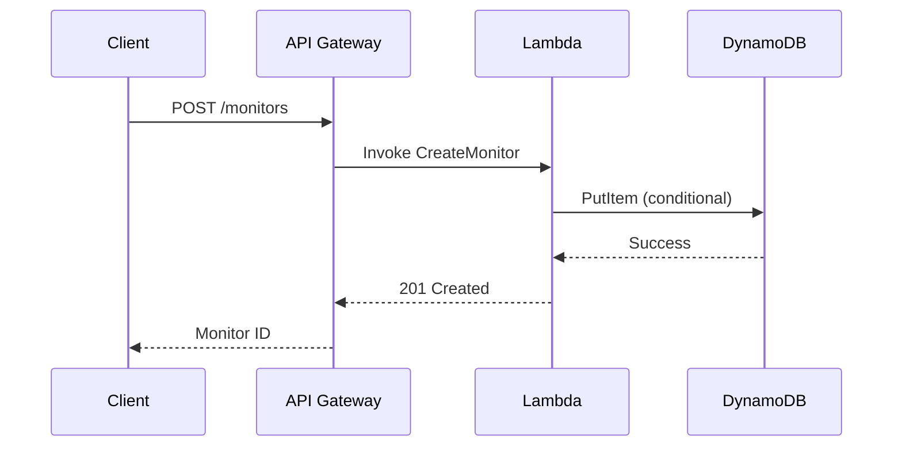
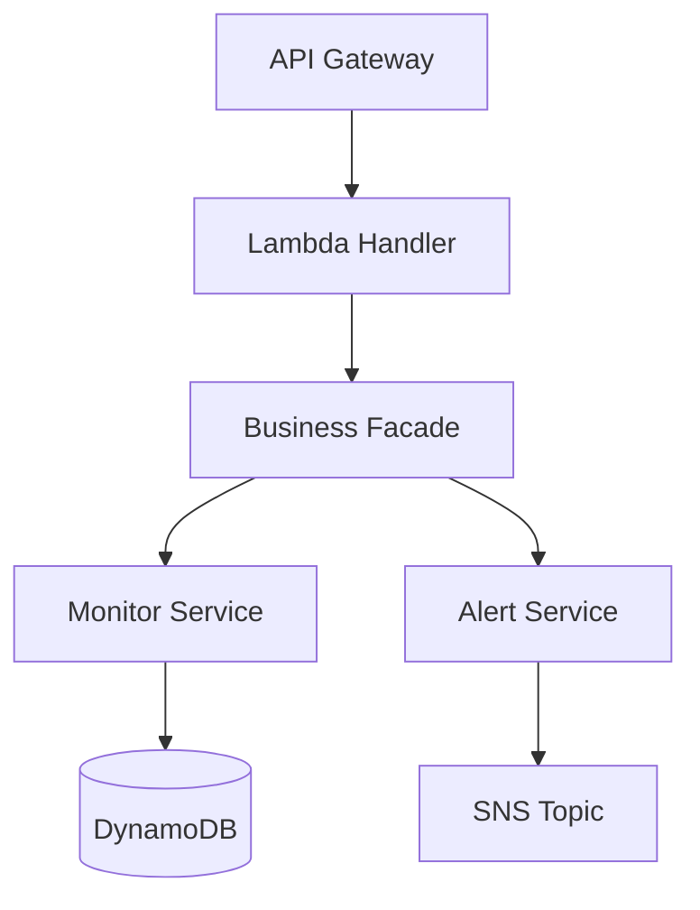

# Kiro Design Generation

## Overview

Decomposes high-level system design artifacts into per-feature low-level designs for Kiro IDE. Takes the system-level architecture (from `system-design-patterns`), threat models, DynamoDB designs, and API specs, then produces a focused `design.md` for each feature that addresses only the components relevant to that feature's requirements.

This skill sits between requirements and implementation. It runs after `kiro-requirements-generation` produces `requirements.md` and before `kiro-task-generation` breaks the design into implementation tasks. The output drives Kiro IDE's spec-driven development, where design.md is the blueprint for task generation.

## Usage

Use this skill when:

- `requirements.md` is approved and ready for design decomposition
- A system design exists (from `system-design-patterns`) and needs per-feature breakdown
- Starting the design phase of a Kiro IDE spec-driven workflow
- Converting existing architecture documents into Kiro IDE design format

Do NOT use when:

- Requirements are not yet written. Use `kiro-requirements-generation` first
- No system design exists. Use `system-design-patterns` first
- You need to generate implementation tasks. Use `kiro-task-generation` after this skill

## Input

This skill consumes multiple upstream artifacts:

1. **requirements.md** from `kiro-requirements-generation`: EARS-format requirements for the feature at `{spec_dir}/requirements.md`
2. **System Design** from `system-design-patterns`: high-level architecture, component diagrams, data flow
3. **Threat Model** from `threat-modeling`: STRIDE analysis, security controls, trust boundaries
4. **DynamoDB Design** from `dynamodb-design`: table schemas, PK/SK design, GSIs, access patterns
5. **API Specs** from `smithy-modeling`: Smithy service definitions, operation signatures, input/output shapes

Input can come from:

- Handoff files in `.konductor/handoff/` (e.g., `architect-system-design.md`)
- Design documents provided directly in conversation
- Existing architecture artifacts referenced by the user

Not all inputs are required. Use what is available. At minimum, `requirements.md` and a system design are needed.

## Output

```
{spec_dir}/design.md
```

`spec_dir` (optional): path where spec artifacts are written. Defaults to `.kiro/specs/{feature-name}/` if not provided. This is the same location Kiro IDE itself writes specs to, so this skill behaves identically whether invoked standalone in any Kiro project or as part of a larger workflow. A caller that keeps its artifacts elsewhere passes its own `spec_dir`, and this skill MUST read and write there instead.

One `design.md` per feature, placed alongside the corresponding `requirements.md` in the same `spec_dir`.

Example directory structure after both skills run, using the default `spec_dir`:

```
.kiro/specs/
├── network-monitoring/
│   ├── requirements.md
│   └── design.md
├── vpc-analyzer/
│   ├── requirements.md
│   └── design.md
```

## Required 6 Sections

Every `design.md` MUST contain exactly these 6 sections in this order. This is the Kiro IDE design document format.

### 1. Overview

High-level description of the feature design. Includes:

- What the feature does and why (1-2 paragraphs)
- Which requirements from `requirements.md` this design addresses
- Key design decisions and their rationale
- Scope boundaries: what is and is not included

### 2. Architecture

System architecture and component relationships for this feature. Includes:

- Component diagram showing how this feature's components interact
- Integration points with existing system components
- Data flow for the primary use case
- Mermaid diagrams (SHOULD include at least one)

Example Mermaid sequence diagram:

````markdown

````

Example Mermaid architecture diagram:

````markdown

````

### 3. Components and Interfaces

Detailed component descriptions with API interfaces and function signatures. For each component:

- Purpose and responsibility
- Public interface (function signatures with types)
- Dependencies on other components
- Configuration parameters

Example:

```typescript
// MonitorService - manages monitor lifecycle
interface MonitorService {
  createMonitor(input: CreateMonitorInput): Promise<Monitor>;
  getMonitor(monitorId: string): Promise<Monitor | null>;
  updateMonitor(monitorId: string, input: UpdateMonitorInput): Promise<Monitor>;
  deleteMonitor(monitorId: string): Promise<void>;
  listMonitors(filters: MonitorFilters): Promise<PaginatedResult<Monitor>>;
}
```

### 4. Data Models

Database schemas, data structures, and relationships. Includes:

- DynamoDB table design (PK, SK, GSIs) if applicable
- TypeScript interfaces for domain entities
- Request/response shapes for API operations
- Relationships between entities

Example:

```typescript
interface Monitor {
  monitorId: string; // PK: MONITOR#<id>
  accountId: string; // SK: ACCOUNT#<id>
  name: string;
  status: 'ACTIVE' | 'PAUSED' | 'ERROR';
  config: MonitorConfig;
  createdAt: string; // ISO 8601
  updatedAt: string; // ISO 8601
}
```

### 5. Error Handling

Error scenarios and handling strategies. For each error scenario:

- What triggers the error
- How the system responds
- What the user sees
- Recovery strategy (retry, fallback, escalate)

Cover at minimum:

- Input validation errors (400)
- Authentication/authorization failures (401/403)
- Resource not found (404)
- Conflict/race conditions (409)
- Downstream service failures (502/503)
- Throttling (429)

### 6. Testing Strategy

Unit, integration, and E2E testing approach for this feature. Includes:

- Unit test scope: what to mock, what to test in isolation
- Integration test scope: which component interactions to verify
- E2E test scope: critical user journeys to validate
- Test data strategy: fixtures, factories, seed data

Example:

```
Unit Tests:
- MonitorService.createMonitor: validates input, calls repository, returns monitor
- MonitorService.createMonitor: throws ConflictError on duplicate name

Integration Tests:
- POST /monitors → creates monitor in DynamoDB → returns 201
- POST /monitors with duplicate name → returns 409

E2E Tests:
- Create monitor → verify in dashboard → receive first alert
```

## Decomposition Rules

When extracting per-feature design from the system-level design:

### Requirement Mapping

- Each requirement from `requirements.md` MUST map to at least one component in the design
- Create a traceability note in the Overview section listing which requirements are addressed
- If a requirement cannot be addressed by the design, flag it explicitly

### Feature Scoping

- Include only components that are directly involved in this feature
- For shared components (e.g., auth middleware, logging), reference them but do not duplicate their full design
- Use a brief description: "Uses the shared AuthMiddleware (see system design) for JWT validation"

### Cross-Feature References

- If this feature depends on another feature's components, reference the other feature's design.md
- Example: "Depends on the Alert entity from `.kiro/specs/alert-management/design.md`"
- Do not copy component designs across features. Reference and extend instead

### Granularity

- Each design.md should be self-contained enough to generate implementation tasks
- A developer reading only this design.md (plus requirements.md) should understand what to build
- Target 100-300 lines per design.md. Split overly complex features into sub-features if larger

## Mermaid Diagrams

Design documents SHOULD include Mermaid diagrams for visual clarity:

- **Sequence diagrams** for key request/response flows (API calls, async processing)
- **Architecture diagrams** (graph TD/LR) for component relationships
- **State diagrams** for entities with lifecycle states (e.g., Monitor: ACTIVE → PAUSED → ERROR)
- **ER diagrams** for complex data relationships

Keep diagrams focused: one diagram per concept. A single complex diagram is harder to understand than 2-3 focused ones.

## Execution

When this skill is activated, follow these steps:

### Step 1: Read requirements.md

Read the approved `requirements.md` from `{spec_dir}/requirements.md`. Extract:

- All requirements and their acceptance criteria
- The feature scope and user personas
- Any NFRs or constraints mentioned in the introduction

### Step 2: Read System Design

Read the system-level design artifacts. Sources (in priority order):

1. Handoff file: `.konductor/handoff/architect-system-design.md`
2. Design documents provided directly in conversation
3. Existing architecture artifacts referenced by the user

Also read supplementary artifacts if available:

- Threat model from `.konductor/handoff/architect-threat-model.md`
- DynamoDB design from `.konductor/handoff/architect-dynamodb-design.md`
- API specs from `.konductor/handoff/architect-api-specs.md`

### Step 3: Identify Feature-Specific Components

From the system design, extract only the components relevant to this feature:

1. Map each requirement to the components that implement it
2. Identify the data flow path for the feature's primary use case
3. Note shared components that are used but not owned by this feature
4. Identify integration points with external services or other features

### Step 4: Write design.md

Write the design document with all 6 required sections:

1. **Overview**: summarize the feature design, list addressed requirements, state key design decisions
2. **Architecture**: draw component relationships, include at least one Mermaid diagram
3. **Components and Interfaces**: define each component's interface with typed function signatures
4. **Data Models**: specify schemas, entities, and relationships with TypeScript interfaces
5. **Error Handling**: cover error scenarios per the acceptance criteria plus standard HTTP errors
6. **Testing Strategy**: define unit/integration/E2E scope with concrete test case examples

### Step 5: Validate

Before presenting output, verify:

- [ ] All 6 required sections are present and non-empty
- [ ] Every requirement from requirements.md is addressed by at least one component
- [ ] At least one Mermaid diagram is included (sequence or architecture)
- [ ] Error handling covers validation, auth, not-found, conflict, and downstream failures
- [ ] Testing strategy covers unit, integration, and E2E levels
- [ ] Component interfaces use typed signatures (not vague descriptions)
- [ ] Data models include field types and constraints
- [ ] design.md is placed alongside requirements.md in `{spec_dir}`

## Quality Gate

**CRITICAL (must fix before done):**

- Missing any of the 6 required sections (Overview, Architecture, Components and Interfaces, Data Models, Error Handling, Testing Strategy)
- Design does not address all requirements from requirements.md. Every requirement must trace to at least one component
- Component interfaces missing typed function signatures
- Data models missing field types
- design.md placed in wrong directory (must be alongside requirements.md)

**IMPORTANT (should fix):**

- No Mermaid diagrams. At least one sequence or architecture diagram should be included
- Missing error scenarios for operations that call external services or accept user input
- Testing strategy missing one of the three levels (unit, integration, E2E)
- Shared components fully duplicated instead of referenced
- Design exceeds 300 lines without splitting into sub-features

**SUGGESTION:**

- Could add design decision rationale (why this approach over alternatives)
- Could add state diagrams for entities with lifecycle states
- Could add performance considerations (expected latency, throughput)
- Could add a "Future Considerations" section for known extensions

Present findings as: CRITICAL → IMPORTANT → SUGGESTION. Ask: "Fix these issues? [y/n]", unless `scope_confirmed` is true, in which case report all the findings and leave fixing to the caller, without asking.
